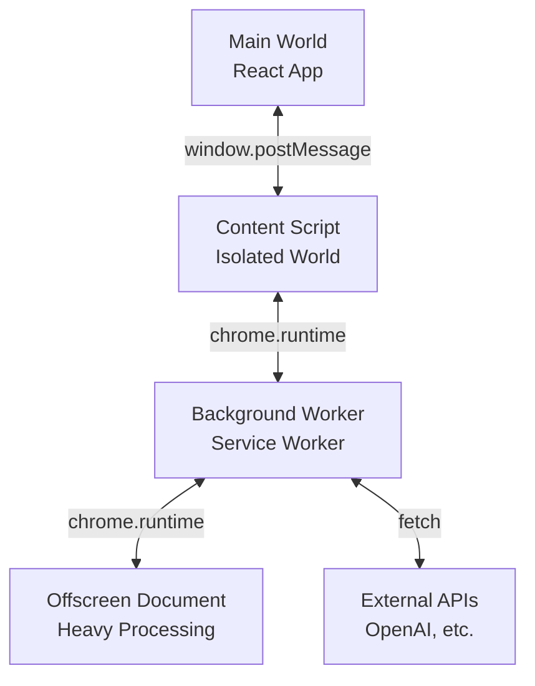
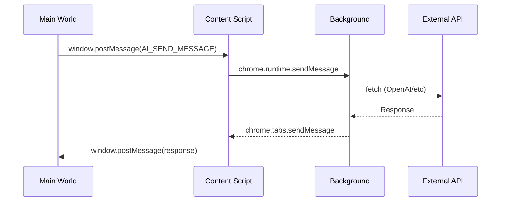

VAssist's Chrome extension uses a sophisticated multi-layer architecture to inject a 3D AI assistant into any webpage while maintaining complete isolation from the host page.

## Multi-Layer Architecture

The extension operates across **four isolated contexts**, each with specific responsibilities:



### 1. Main World (React App)

**Location**: Injected `<script>` in host page  
**Access**: Full DOM access, same origin as host page  
**Limitations**: Cannot use `chrome.*` APIs directly

**Responsibilities:**
- Render React UI in Shadow DOM
- Handle user interactions
- Manage 3D character (Babylon.js)
- Display chat messages and animations

**Communication:**
```javascript
// Send message to content script
window.postMessage({
  __VASSIST_MESSAGE__: true,
  type: 'AI_SEND_MESSAGE',
  requestId: 'req-123',
  payload: { messages: [...] }
}, '*');

// Receive response from content script
window.addEventListener('message', (event) => {
  if (event.data.__VASSIST_RESPONSE__) {
    // Handle response
  }
});
```

<Note>
  The React app runs in the "Main World" (same JavaScript context as the host page) but renders UI inside a Shadow DOM for CSS isolation.
</Note>

### 2. Content Script (Isolated World)

**Location**: `extension/content/index.js`  
**Access**: Separate JavaScript context, same DOM  
**File**: `/home/daytona/workspace/source/extension/content/index.js:1

**Responsibilities:**
- Inject React app script into page
- Bridge between Main World and Background
- Manage Shadow DOM container
- Handle injection lifecycle (show/hide/cleanup)

**Key Features:**
```javascript
class VirtualAssistantInjector {
  async injectAssistant() {
    // Create container with Shadow DOM
    this.container = document.createElement('div');
    this.shadowRoot = this.container.attachShadow({ mode: 'open' });
    
    // Inject styles into Shadow DOM
    await this.injectStyles();
    
    // Inject React app script
    await this.injectReactApp();
    
    // Setup message bridge
    this._setupMessageBridge();
  }
}
```

**Message Bridge:**
```javascript
// Forward messages from Main World to Background
window.addEventListener('message', async (event) => {
  if (event.data.__VASSIST_MESSAGE__) {
    const { type, payload, requestId } = event.data;
    
    // Send to background via chrome.runtime
    const { promise } = this.bridge.sendMessage(type, payload);
    const response = await promise;
    
    // Forward response back to Main World
    window.postMessage({
      __VASSIST_RESPONSE__: true,
      requestId,
      payload: response
    }, '*');
  }
});
```

<Note>
  Content scripts bridge the gap between the Main World (which can't access `chrome.*` APIs) and the Background Worker (which can).
</Note>

### 3. Background Service Worker

**Location**: `extension/background/index.js`  
**Access**: Full `chrome.*` API access, no DOM  
**Lifecycle**: Persistent (kept alive during active sessions)  
**File**: `/home/daytona/workspace/source/extension/background/index.js:1

**Responsibilities:**
- Handle all AI/TTS/STT service requests
- Manage per-tab state via TabManager
- Route messages to appropriate handlers
- Control offscreen document lifecycle
- Make external API calls

**Message Handler Pattern:**
```javascript
backgroundBridge.registerHandler(
  MessageTypes.AI_SEND_MESSAGE,
  async (message, sender, tabId) => {
    const { messages, options } = message.data;
    
    // Call AI service for this tab
    const result = await aiService.sendMessage(
      messages,
      streamCallback,
      tabId,
      options
    );
    
    return { response: result.response };
  }
);
```

**Tab Management:**
```javascript
class TabManager {
  initTab(tabId) {
    const tabState = {
      id: tabId,
      chatState: { messages: [], isProcessing: false },
      abortControllers: new Map(),
      created: Date.now(),
      lastActivity: Date.now()
    };
    this.tabs.set(tabId, tabState);
  }
  
  cleanupTab(tabId) {
    // Abort all pending requests
    // Clean up resources
    this.tabs.delete(tabId);
  }
}
```

### 4. Offscreen Document

**Location**: `extension/offscreen/offscreen.js`  
**Access**: AudioContext, Web Workers, full processing power  
**Purpose**: Heavy audio processing and Kokoro TTS  
**File**: `/home/daytona/workspace/source/extension/offscreen/offscreen.js:1

**Why Offscreen?**
- Service workers have limited runtime (30 seconds idle timeout)
- AudioContext not available in service workers
- Heavy processing (Kokoro TTS, lip sync) needs stable context
- Can run for minutes without interruption

**Responsibilities:**
- Kokoro TTS model loading and inference (1-2 minutes)
- Audio decoding with AudioContext
- VMD lip sync generation (10-20 seconds)
- BVMD animation conversion

**Example Handler:**
```javascript
async handleKokoroInit(message) {
  const { modelId, device } = message.data;
  
  // Initialize Kokoro (can take 1-2 minutes)
  const initialized = await KokoroTTSCore.initialize(
    { modelId, device },
    (progress) => {
      // Send progress back to background
      chrome.runtime.sendMessage({
        type: MessageTypes.KOKORO_DOWNLOAD_PROGRESS,
        data: progress
      });
    }
  );
  
  return { initialized };
}
```

<Note>
  The offscreen document only handles messages explicitly targeted to it (`message.target === 'offscreen'`), allowing it to coexist with other message listeners.
</Note>

## Message Passing System

### Message Flow

Typical message flow for an AI chat request:



### Streaming Messages

For streaming responses (AI chat, TTS):

```javascript
// Background sends stream tokens
chrome.tabs.sendMessage(sender.tab.id, {
  type: MessageTypes.AI_STREAM_TOKEN,
  requestId: message.requestId,
  data: { token: 'Hello' }
});

// Content script forwards to Main World
window.postMessage({
  __VASSIST_STREAM_TOKEN__: true,
  requestId: mainRequestId,
  token: 'Hello'
}, '*');

// Main World receives token
window.addEventListener('message', (event) => {
  if (event.data.__VASSIST_STREAM_TOKEN__) {
    // Append token to UI
  }
});
```

### Message Types

Defined in `extension/shared/MessageTypes.js`:

```javascript
export const MessageTypes = {
  // Tab lifecycle
  TAB_INIT: 'TAB_INIT',
  TAB_CLEANUP: 'TAB_CLEANUP',
  
  // AI service
  AI_SEND_MESSAGE: 'AI_SEND_MESSAGE',
  AI_STREAM_TOKEN: 'AI_STREAM_TOKEN',
  AI_ABORT: 'AI_ABORT',
  
  // TTS service
  TTS_GENERATE_SPEECH: 'TTS_GENERATE_SPEECH',
  KOKORO_INIT: 'KOKORO_INIT',
  KOKORO_GENERATE: 'KOKORO_GENERATE',
  
  // Storage
  STORAGE_CONFIG_SAVE: 'STORAGE_CONFIG_SAVE',
  STORAGE_CONFIG_LOAD: 'STORAGE_CONFIG_LOAD',
  
  // And many more...
};
```

## Shadow DOM Isolation

VAssist uses Shadow DOM to achieve **zero CSS conflicts** with host pages.

### Architecture

```html
<!-- Host Page DOM -->
<body>
  <!-- Host page content -->
  
  <!-- VAssist container -->
  <div id="virtual-assistant-extension-root">
    #shadow-root (closed)
      <!-- VAssist UI (completely isolated) -->
      <link rel="stylesheet" href="content-styles.css">
      <div id="react-root">
        <!-- React app renders here -->
      </div>
  </div>
  
  <!-- Canvas outside Shadow DOM (Babylon.js needs direct access) -->
  <canvas id="vassist-babylon-canvas"></canvas>
</body>
```

### Why Shadow DOM?

- **CSS Isolation**: Host page styles can't affect VAssist UI
- **JavaScript Isolation**: Host page scripts can't interfere
- **Clean Namespace**: No ID/class conflicts
- **Scoped Tailwind**: Tailwind styles only apply inside shadow root

### Canvas Portal

The 3D canvas lives **outside** Shadow DOM because:
- Babylon.js WebGL context needs direct browser access
- Better performance without shadow boundary overhead
- Positioned absolutely, so no layout conflicts

```javascript
// Render canvas outside Shadow DOM
const canvas = document.createElement('canvas');
canvas.id = 'vassist-babylon-canvas';
document.body.appendChild(canvas); // Outside shadow root
```

## Per-Tab State Management

Each browser tab maintains **completely isolated state**:

### Tab State Structure

```javascript
const tabState = {
  id: tabId,
  chatState: {
    messages: [],           // Chat history
    isProcessing: false     // AI generating?
  },
  abortControllers: new Map(),  // Cancel requests
  created: Date.now(),
  lastActivity: Date.now()
};
```

### Per-Tab Services

```javascript
// Each service maintains per-tab state
class AIService {
  constructor() {
    this.tabStates = new Map(); // tabId -> state
  }
  
  initTab(tabId) {
    this.tabStates.set(tabId, {
      provider: null,
      config: null,
      isGenerating: false,
      abortController: null
    });
  }
  
  async sendMessage(messages, streamCallback, tabId) {
    const state = this.tabStates.get(tabId);
    // Use per-tab state for this request
  }
}
```

### Automatic Cleanup

```javascript
// Clean up inactive tabs every minute
setInterval(() => {
  const oneHour = 60 * 60 * 1000;
  const now = Date.now();
  
  for (const [tabId, tab] of this.tabs.entries()) {
    if (now - tab.lastActivity > oneHour) {
      this.cleanupTab(tabId);
    }
  }
}, 60000);
```

## Service Worker Lifecycle

### Keepalive Strategy

Service workers can terminate after 30 seconds of inactivity. VAssist keeps the worker alive during:

- Active AI chat sessions
- TTS/STT processing
- Kokoro model loading (1-2 minutes)
- VMD generation (10-20 seconds)

```javascript
class OffscreenManager {
  startLongRunningJob(requestId) {
    this.activeJobs.set(requestId, Date.now());
    this.keepAlive(); // Prevent worker termination
  }
  
  keepAlive() {
    // Create dummy port to keep service worker alive
    chrome.runtime.connect({ name: 'keepalive' });
  }
}
```

### Offscreen Document Lifecycle

```javascript
async function ensureOffscreenDocument() {
  // Check if offscreen document exists
  const existingContexts = await chrome.runtime.getContexts({
    contextTypes: ['OFFSCREEN_DOCUMENT']
  });
  
  if (existingContexts.length === 0) {
    // Create offscreen document
    await chrome.offscreen.createDocument({
      url: 'offscreen.html',
      reasons: ['AUDIO_PLAYBACK'],
      justification: 'Audio processing and TTS generation'
    });
  }
}
```

## Security Considerations

### Content Security Policy

```json
{
  "content_security_policy": {
    "extension_pages": "script-src 'self' 'wasm-unsafe-eval'; object-src 'self'"
  }
}
```

- `'wasm-unsafe-eval'`: Required for Transformers.js (Kokoro TTS)
- `'self'`: Only load scripts from extension origin

### Permissions

```json
{
  "permissions": [
    "storage",      // chrome.storage API
    "tabs",         // Tab management
    "scripting",    // Dynamic script injection
    "offscreen",    // Offscreen document
    "activeTab"     // Current tab access
  ]
}
```

### Host Permissions

```json
{
  "host_permissions": [
    "https://api.openai.com/*",  // OpenAI API
    "http://localhost:*/*",       // Local dev
    "http://127.0.0.1:*/*"        // Local dev
  ]
}
```

## Testing the Extension

### Loading Unpacked Extension

<Steps>
  <Step title="Build the extension">
    ```bash
    bun run build:extension
    ```
  </Step>

  <Step title="Open Chrome Extensions page">
    Navigate to `chrome://extensions/` and enable "Developer mode"
  </Step>

  <Step title="Load unpacked">
    Click "Load unpacked" and select the `dist/extension` folder
  </Step>

  <Step title="Test on websites">
    Visit any website and click the extension icon to toggle VAssist
  </Step>
</Steps>

### Multi-Tab Testing

1. Open VAssist in Tab A
2. Start a conversation
3. Open VAssist in Tab B
4. Start a different conversation
5. Switch between tabs - each should maintain independent state

### Debugging Tips

- **Check all consoles**: Main page, background worker, offscreen document
- **Use `Logger` prefixes**: `[Content]`, `[Background]`, `[Offscreen]`
- **Monitor message flow**: Add breakpoints in message bridges
- **Test cleanup**: Close tabs and verify state cleanup

## Next Steps

- **[Contributing Guide](/development/contributing)** - Start contributing
- **[Architecture Overview](/development/architecture)** - Understand code organization
- **[Components Reference](/api/components)** - Explore available APIs